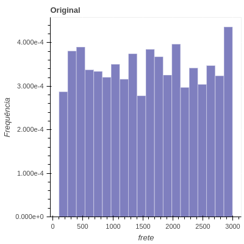

# Análise da conversão (Desafio B2W)

### Objetivo: 
analisar a conversão de visitas em pedidos de acordo com grupos semânticos gerados por clusterização.

### Dados:
Para cada visita há as seguintes informações: frete, prazo, preco, latitude e longitude. Além disso, também temos o id do produto com o qual, usando outra tabela, obtemos informações como numero de fotos, tamanho da descrição, tamanho do nome do produto. Essas informações foram descartadas das análises. Apenas a presença de fotos seria considerada inicialmente, porém como 

Os dados são separados por departamentos. Apesar da categoria dos produtos influenciar a taxa de conversão, deixaremos esse agrupamento a cargo da clusterização que será realizada posteriormente.

Vale ressaltar que existem outras informações comumente relacionadas a taxa de conversão no e-commerce como por exemplo a fonte (como o consumidor chegou à página do produto), se a visita é pelo celular ou pelo desktop.

As variáveis escolhidas foram: preco, frete, prazo, quantidade de fotos e comprimento da descrição. Essas variáveis foram escolhidas uma vez que, intuitamente, influenciam na decisão de compra. Uma pessoa dificilmente compraria um produto sem foto. Vale ressaltar ainda que muitas vezes os próprios dados podem fornecer insights a princípio contra-intuitivos. Além das variáveis citadas, também utilizamos a informação de localização do cliente. Por exemplo, uma pessoa que mora longe dos grandes centros terá, provavelmente, fretes mais caros e prazos mais longos naturalmente e, então aceitará fretes e prazos maiores que a pessoa média nos grandes centros. Para utilizar as variáveis de latitude e logitude é necessário um processamento prévio. Neste projeto encontramos 5 centroides via kmeans e utilizamos como variável a distância ao centroide mais próximo (os centroides poderiam ser associados aos centros de distribuição). A escolha de 5 centroides foi arbitraria. 

As figuras a seguir mostram o histograma das variáveis selecionadas e _scatter plots_ de preco, prazo e frete 2 a 2.

Como se pode observar nos _scatter plots_ as três variáveis parecem descorrelacionadas. Além disso, quando plotados apenas os dados convertidos (em azul), não se observa nenhum tipo de tendência no _sccater plot_. 

## Escalamento
O escalamento é uma etapa importante do pre-processamento visto evita um viés para algumas variáveis  devido a diferentes magnitudes em cada dimensão (em geral quando as variáveis apresentam siginificados muito diferentes).  
Foram utilizados os 6 escalamentos sugeridos

#### Normalize:
A transformação normalizer já implementada transforma cada linha de features de forma a ter norma 2 unitária. Essa transformação balanceia a contribuição de cada feature. Por exemplo, se o preço do produto for maior que o do frete, o preco do produto transformado será maior que o preco do frete. Note que há variáveis que não são comparáveis em magnitude, por exemplo, preco e prazo. Assim, essa transformação não faz muito sentido com as variáveis previamente selecionadas.

[fig](../dataset-desafio-ia-front/plots/08062020-14062020/minmax_scaler_latitude-longitude.html)

### StandardScaler:
Essa transformação torna a média zero e o desvio padrão unitário para cada vaŕiavel. A média e o desvio padrão são computados de forma global e são sensíveis a outliers. É utilizada quando os dados são provenientes a distribuição gaussiana.
#### MaxAbsScaler:
Essa transformação torna todas as variáveis entre -1 e 1 de forma global, isto é, para cada _feature_, o máximo é computado considerando todas as visitas. Esse método é sensível a outliers

#### MinMaxScaler:
Essa transformação torna todas as variáveis entre 0 e 1 de forma global, isto é, para cada feature, o máximo e o mínimo são computados considerando todas as visitas. Esse método é útil quando os dados não são _Gaussian-like_ ou quando a variância é muito pequena. Esse método é sensível a outliers

#### RobustScaler: 
Diferente dos métodos anteriores, esse método efetua a padronização usando a mediana e quantis e por isso é menos sensível a outliers. É útil quando o dataset contém outliers que podem prejudicar o algoritmo que se deseja utilizar.

##### Power Transform:
Este pre-processamento torna as variáveis mais parecidas com Gaussianas. Após a transformação, o resultado é transformado para ter média zero e variancia unitária. Este método é útil para preparar dados que serão entregues a modelos que assumem normalidade dos dados.
### Usando uma semana de dados como entrada e vendo os gráficos, o que você pode dizer sobre cada uma das transformações?

* usando 01/06/2020 - 07/06/2020
* StandardScaler, MaxAbsScaler e MinMaxScaler, RobustScaler, não modificam o formato das distribuição como pode ser observado nos histogramas, apenas o range das variáveis é alterado.
* Utilizando o Normalizer, frete x preco é trasformado em uma parábola. A distribuição do frete foi deslocada para direita enquanto a distribuição do prazo foi deslocada para esquerda. A distribuição do preco assumiu um formato bimodal (em 0.5 e 1). Note que a magnitude do prazo é muito menor que a do frete e do preco e, dessa forma, contribuirá menos para a clusterização. 
* O PowerTransformer tende a Gaussianizar as variáveis, além de torná-la de média zero e variância unitária. Tanto o preco quanto o frete tiveram a densidade deslocada para direita, enquanto o prazo permaneceu com um formato de distribuição uniforme.
* usando 14/06/2020 - 21/06/2020, nenhuma alteração evidente foi observada. No caso da Power transform, a distribuição do frete ficou mais concentrada à direita que não primeira semana de junho.
* As variáveis utilizadas parecem uniformemente distribuídas e, não sofreram alterações no formato da distribuição, apenas no suporte. O Normalizer e o Power Transform alteraram principalmente o formato do frete e do prazo.  
 
Para próxima etapa, seguiremos com o MaxAbsScaler, RobustScaler e PowerTransformer. O standardRcaler foi descartado porque os dados não são gaussianos e o normalizer foi descartado pelo motivo já mencionado.

### Clusterização

Observando as variáveis isoladamente, não é possível extrair informação acerca da conversão. O objetivo desta etapa é clusterizar os dados e efetuar a análise de conversão por grupo. Como os dados são volumos, o algoritmo de clusterização deve ser escalável. Além disso, como observado nos _scatter plots_, os dados apresentam geometria flat e a densidade de pontos é razoavelmente uniforme. Assim, algoritmos baseados em densidade, por exemplo, podem encontrar apenas um grande grupo. Como pouquíssimas features foram utilizadas, selecionamos apenas 4 clusters.

Como o critério principal foi a escalabilidade, os algoritmos escolhidos foram: 

* Kmeans: apresenta grande escalabilidade e se baseia na distância entre pontos. Dessa forma, espera-se 4 grandes clusters para todos os scalings. Há também o MiniBatchKMeans que atualiza os centroides de maneira mais computacionalmente eficiente e, sem perder muita performance.
* Birch: apresenta grande escalabilidade pois não guarda os dados na memória. Uma árvore de features é construída comprimindo os dados (por isso é utilizada para redução de dimensão). Esse algoritmo não escala bem para features, porém estamos utilizando muito poucas features.
* DBSCAN: compara a densidade entre vizinhos. Embora seja considerado escalável, sua implementação no sckit-learn armazena uma matriz o que torna inviável. Assim, apenas 1% dos dados foram utilziados nessa clusterização. Uma alternativa é OPTICS #TODO
* AgglomerativeClustering (com linkage=ward): reduz a variância dos clusters de forma hierárquica. Embora seja considerado escalável, também depende de computar uma matriz e, por isso o consumode memória é O(N^2). Dessa forma, apenas 1% dos dados foram utilizados. 

###Resultados
##TODO 

## Pipeline

O Arquivo Makefile contém os jobs implementados seguindo o pipeline proposto:

* Para executar o script em _../pedidos/job.py_:  
 ``$ make pedidos --SOURCE=<source path> --DATA_INICIAL=<data incial> --DATA_FINAL=<data final>`` 

* Para escalar os dados com método "transform":
``$ make scale SOURCE=<source path> DATA_INICIAL=<data incial> DATA_FINAL=<data final> TRANSFORM=<transform> `` 

*Para plotar os resultados escalados:
``$ make scale-plots SOURCE=<source path> PLOTS=<plots path> --DATA_INICIAL=<data incial> DATA_FINAL=<data final> TRANSFORM=<transform> `` 

*para clusterizar os dados escalados por "transform" utilizando o método de clsuterizacao "cluster_method"
``$ make cluster SOURCE=<source path> PLOTS=<plots path> DATA_INICIAL=<data incial> DATA_FINAL=<data final> TRANSFORM=<transform> CLUSTER_METHOD=<cluster_method> N_SAMPLES=<porcentagem de amostras usadas> DROP<se deve dropar as colunas de departamentos>`` 

*para gerar gráficos e calcular a conversão dos dados escalados por "transform" utilizando o método de clsuterizacao "cluster_method" utilizando a partição temporal "particao"
``$ make conversao SOURCE=<source path> PLOTS=<plots path> DATA_INICIAL=<data incial> DATA_FINAL=<data final> TRANSFORM=<transform> CLUSTER_METHOD=<cluster_method> N_SAMPLES=<porcentagem de amostras usadas para plot> PARTICAO=<particao>``

* Para rodar o pipeline todo para uma transformação específica:
``$ make run SOURCE=<source path> PLOTS=<plots path> DATA_INICIAL=<data incial> DATA_FINAL=<data final> transform=<transform>  N_SAMPLES=<porcentagem de amostras usadas> DROP<se deve dropar as colunas de departamentos>`` 