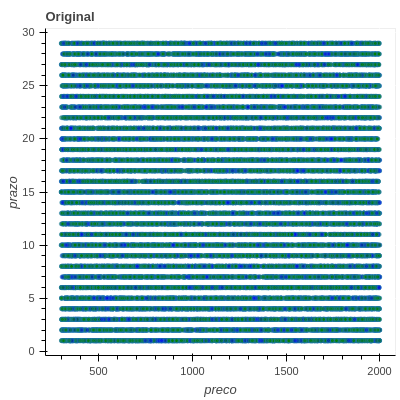
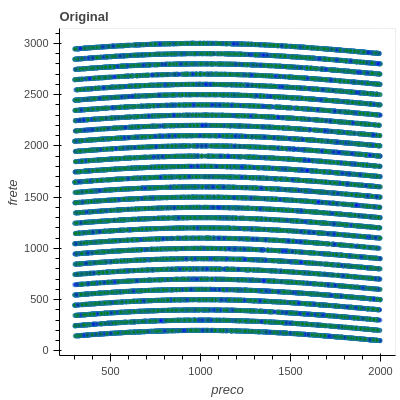
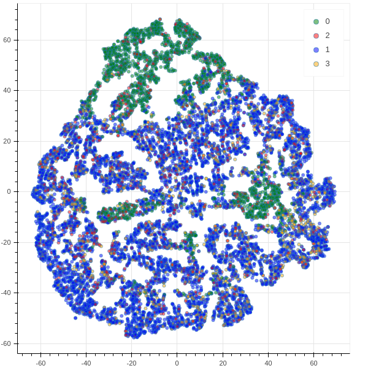

# Análise da conversão (Desafio B2W)

### Objetivo: 
analisar a conversão de visitas em pedidos de acordo com grupos semânticos gerados por clusterização.

Os datasets resultantes da última tarefa estão [aqui](https://drive.google.com/drive/folders/1x8GiWaSFhgc3ccGDu-BmnKOhNXu46n9j?usp=sharing).
### Dados:
Para cada visita há as seguintes informações: frete, prazo, preco, latitude e longitude. Além disso, também temos o id do produto com o qual, usando outra tabela, obtemos informações como numero de fotos e  tamanho da descrição.

Os dados são separados por departamentos. Apesar da categoria dos produtos influenciar a taxa de conversão, deixaremos esse agrupamento a cargo da clusterização que será realizada posteriormente.

Os dados vão de 01/06/2020 a 31/07/2020, totalizando 22.613.872 vistas. Como são muitas visitas, a cada hora são amostradas 500 visitas (A amostragem foi aleatória sem nenhuma estratificação em relação a departamento ou à conversão. Como a taxa de conversão será avaliada, a distribuição de conversão foi mantida). Do dataset total, a média de conversão é de 16%. O [sumário](reports/summary.csv) apresenta a média, desvio padrão, valor mínimo e valor máximo (em alguns casos essas estatísticas não fazem sentido). Além disso, não há nenhuma variável diretamente correlacionada com a taxa de conversão. As figuras a seguir mostram a conversão por dia da semana e por hora do dia (agrupa as mesmas horas e os mesmos dias). Nestes  dados, não há nenhuma tendência explicita em veração à taxa de conversão por dia ou por hora.

Vale ressaltar que existem outras informações comumente relacionadas a taxa de conversão no e-commerce como por exemplo a fonte (como o consumidor chegou à página do produto), se a visita é pelo celular ou pelo desktop.

As variáveis escolhidas foram: preco, frete, prazo, quantidade de fotos e comprimento da descrição. Essas variáveis foram escolhidas uma vez que, intuitamente, influenciam na decisão de compra. Uma pessoa dificilmente compraria um produto sem foto (no entanto o número mínimo de fotos por produto é 1). Vale ressaltar ainda que muitas vezes os próprios dados podem fornecer insights a princípio contra-intuitivos. Além das variáveis citadas, também utilizamos a informação de localização do cliente. Por exemplo, uma pessoa que mora longe dos grandes centros terá, provavelmente, fretes mais caros e prazos mais longos naturalmente e, então aceitará fretes e prazos maiores que a pessoa média nos grandes centros. Para utilizar as variáveis de latitude e logitude é necessário um processamento prévio. Neste projeto encontramos 5 centroides via kmeans e utilizamos como variável a distância ao centroide mais próximo (os centroides poderiam ser associados aos centros de distribuição). A escolha de 5 centroides foi arbitraria. 

As figuras a seguir mostram o histograma das variáveis selecionadas e _scatter plots_ de preco, prazo e frete 2 a 2.

Como se pode observar nos _scatter plots_ as três variáveis parecem descorrelacionadas. Além disso, quando plotados apenas os dados convertidos (em azul), não se observa nenhum tipo de tendência no _sccater plot_. 
O histograma gerado pelo _numpy_ mostra a densidade e não a função de propabilidade e por isso pode atingir valores maiores que 1 (depende da largura do bin). A distância ao centroide mais próximo apresenta outliers (veja que as barras estão bem concentradas à esquerda) que provalvelmente correspondem à visitas de clientes localizados mais ao oeste na América do Sul. 

## Escalamento
O escalamento é uma etapa importante do pre-processamento visto evita um viés para algumas variáveis  devido a diferentes magnitudes em cada dimensão (em geral quando as variáveis apresentam siginificados muito diferentes).  
Foram utilizados os 6 escalamentos sugeridos

#### Normalize:
A transformação normalizer já implementada transforma cada linha de features de forma a ter norma 2 unitária. Essa transformação balanceia a contribuição de cada feature. Por exemplo, se o preço do produto for maior que o do frete, o preco do produto transformado será maior que o preco do frete. Note que há variáveis que não são comparáveis em magnitude, por exemplo, preco e prazo. Assim, essa transformação não faz muito sentido com as variáveis previamente selecionadas.

### StandardScaler:
Essa transformação torna a média zero e o desvio padrão unitário para cada vaŕiavel. A média e o desvio padrão são computados de forma global e são sensíveis a outliers. É utilizada quando os dados são provenientes a distribuição gaussiana.
#### MaxAbsScaler:
Essa transformação torna todas as variáveis entre -1 e 1 de forma global, isto é, para cada _feature_, o máximo é computado considerando todas as visitas. Esse método é sensível a outliers

#### MinMaxScaler:
Essa transformação torna todas as variáveis entre 0 e 1 de forma global, isto é, para cada feature, o máximo e o mínimo são computados considerando todas as visitas. Esse método é útil quando os dados não são _Gaussian-like_ ou quando a variância é muito pequena. Esse método é sensível a outliers

#### RobustScaler: 
Diferente dos métodos anteriores, esse método efetua a padronização usando a mediana e quantis e por isso é menos sensível a outliers. É útil quando o dataset contém outliers que podem prejudicar o algoritmo que se deseja utilizar.

##### Power Transform:
Este pre-processamento torna as variáveis mais parecidas com Gaussianas. Após a transformação, o resultado é transformado para ter média zero e variancia unitária. Este método é útil para preparar dados que serão entregues a modelos que assumem normalidade dos dados.
### Usando uma semana de dados como entrada e vendo os gráficos, o que você pode dizer sobre cada uma das transformações?

* usando 01/06/2020 - 07/06/2020
* preco x prazo: 
[Normalizer](plots/normalize/semana1/normalize_preco-prazo.html), [MinMaxScaler](plots/minmax_scaler/semana1/minmax_scaler_preco-prazo.html), [MaxAbsScaler](plots/maxabs_scaler/semana1/maxabs_scaler_preco-prazo.html), [StandardScaler](plots/standard_scaler/semana1/standard_scaler_preco-prazo.html), [RobustScaler](plots/robust_scaler/semana1/robust_scaler_preco-prazo.html) e [PowerTransformer](plots/power_transformer/semana1/power_transformer_preco-prazo.html).

* preco x frete: 
[Normalizer](plots/normalize/semana1/normalize_preco-frete.html), [MinMaxScaler](plots/minmax_scaler/semana1/minmax_scaler_preco-frete.html), [MaxAbsScaler](plots/maxabs_scaler/semana1/maxabs_scaler_preco-frete.html), [StandardScaler](plots/standard_scaler/semana1/standard_scaler_preco-frete.html),
[RobustScaler](plots/robust_scaler/semana1/robust_scaler_preco-frete.html) e [PowerTransformer](plots/power_transformer/semana1/power_transformer_preco-frete.html).

* frete x prazo:
[Normalizer](plots/normalize/semana1/normalize_frete-prazo.html), [MinMaxScaler](plots/minmax_scaler/semana1/minmax_scaler_frete-prazo.html), [MaxAbsScaler](plots/maxabs_scaler/semana1/maxabs_scaler_frete-prazo.html), [StandardScaler](plots/standard_scaler/semana1/standard_scaler_frete-prazo.html), [RobustScaler](plots/robust_scaler/semana1/robust_scaler_frete-prazo.html) e [PowerTransformer](plots/power_transformer/semana1/power_transformer_frete-prazo.html).

* frete: 
[Normalizer](plots/normalize/semana1/frete-normalize_hist.html), [MinMaxScaler](plots/minmax_scaler/semana1/frete-minmax_scaler_hist.html), [MaxAbsScaler](plots/maxabs_scaler/semana1/frete-maxabs_scaler_hist.html), [StandardScaler](plots/standard_scaler/semana1/frete-standard_scaler_hist.html), [RobustScaler](plots/robust_scaler/semana1/frete-robust_scaler_hist.html) e [PowerTransformer](plots/power_transformer/semana1/frete-power_transformer_hist.html).

* preco:
[Normalizer](plots/normalize/semana1/preco-normalize_hist.html), [MinMaxScaler](plots/minmax_scaler/semana1/preco-minmax_scaler_hist.html), [MaxAbsScaler](plots/maxabs_scaler/semana1/preco-maxabs_scaler_hist.html), [StandardScaler](plots/standard_scaler/semana1/preco-standard_scaler_hist.html), [RobustScaler](plots/robust_scaler/semana1/precorobust_scaler_hist.html) e [PowerTransformer](plots/power_transformer/semana1/preco-power_transformer_hist.html).

* prazo :
[Normalizer](plots/normalize/semana1/prazo-normalize_hist.html), [MinMaxScaler](plots/minmax_scaler/semana1/prazo-minmax_scaler_hist.html), [MaxAbsScaler](plots/maxabs_scaler/semana1/prazo-maxabs_scaler_hist.html), [StandardScaler](plots/standard_scaler/semana1/prazo-standard_scaler_hist.html), [RobustScaler](plots/robust_scaler/semana1/prazo-robust_scaler_hist.html) e [PowerTransformer](plots/power_transformer/semana1/prazo-power_transformer_hist.html).

    
* distância ao centroide mais próximo:
[Normalizer](plots/normalize/semana1/coord_distance-normalize_hist.html), [MinMaxScaler](plots/minmax_scaler/semana1/coord_distance-minmax_scaler_hist.html), [MaxAbsScaler](plots/maxabs_scaler/semana1/coord_distance-maxabs_scaler_hist.html), [StandardScaler](plots/standard_scaler/semana1/coord_distance-standard_scaler_hist.html), [RobustScaler](plots/robust_scaler/semana1/coord_distance-robust_scaler_hist.html) e [PowerTransformer](plots/power_transformer/semana1/coord_distance-power_transformer_hist.html).

    -> O PowerTransformer deslocou a moda das distribuições de preco, prazo e frete para direita. Como as distribuições iniciais eram uniformes, o resultado da transformação não ficou muito Gaussiano. A distância mínima ao centroide e o tamanho da descrição ficaram com formato Gaussiano. O power transform não funcionou muito bem na quantidade de fotos, devido à sua natureza discreta e de baixa cardinalidade.

    -> O normal
    -> StandardScaler, MaxAbsScaler e MinMaxScaler, RobustScaler, não modificam o formato das distribuição como pode ser observado nos histogramas, apenas o range das variáveis é alterado.
    -> Utilizando o Normalizer, frete x preco é trasformado em quase uma parábola, uma vez que seus valores apresentam  mesma magnitude. A distribuição do frete foi deslocada para direita (possui os maiores valores) enquanto a distribuição do prazo foi deslocada para esquerda. A distribuição do preco um formato simétrico. Note que a magnitude do prazo é muito menor que a do frete e do preco e, dessa forma, contribuirá menos para a clusterização. 
    -> O PowerTransformer tende a Gaussianizar as variáveis, além de torná-las de média zero e variância unitária. Tanto o preco quanto o frete tiveram a densidade deslocada para direita, enquanto o prazo permaneceu com um formato de distribuição uniforme.

* usando 08/07/2020 - 15/07/2020
    -> as variáveis preco, frete e prazo não tiveram variação siginificativa nos dados crus, nem transformados. 

 * preco x prazo: 
[Normalizer](plots/normalize/semana2/normalize_preco-prazo.html), [MinMaxScaler](plots/minmax_scaler/semana2/minmax_scaler_preco-prazo.html), [MaxAbsScaler](plots/maxabs_scaler/semana2/maxabs_scaler_preco-prazo.html), [StandardScaler](plots/standard_scaler/semana2/standard_scaler_preco-prazo.html), [RobustScaler](plots/robust_scaler/semana2/robust_scaler_preco-prazo.html) e [PowerTransformer](plots/power_transformer/semana2/power_transformer_preco-prazo.html).

* preco x frete: 
[Normalizer](plots/normalize/semana2/normalize_preco-frete.html), [MinMaxScaler](plots/minmax_scaler/semana2/minmax_scaler_preco-frete.html), [MaxAbsScaler](plots/maxabs_scaler/semana2/maxabs_scaler_preco-frete.html), [StandardScaler](plots/standard_scaler/semana2/standard_scaler_preco-frete.html),
[RobustScaler](plots/robust_scaler/semana2/robust_scaler_preco-frete.html) e [PowerTransformer](plots/power_transformer/semana2/power_transformer_preco-frete.html).

* frete x prazo:
[Normalizer](plots/normalize/semana2/normalize_frete-prazo.html), [MinMaxScaler](plots/minmax_scaler/semana2/minmax_scaler_frete-prazo.html), [MaxAbsScaler](plots/maxabs_scaler/semana2/maxabs_scaler_frete-prazo.html), [StandardScaler](plots/standard_scaler/semana2/standard_scaler_frete-prazo.html), [RobustScaler](plots/robust_scaler/semana2/robust_scaler_frete-prazo.html) e [PowerTransformer](plots/power_transformer/semana2/power_transformer_frete-prazo.html).

* frete: 
[Normalizer](plots/normalize/semana2/frete-normalize_hist.html), [MinMaxScaler](plots/minmax_scaler/semana2/frete-minmax_scaler_hist.html), [MaxAbsScaler](plots/maxabs_scaler/semana2/frete-maxabs_scaler_hist.html), [StandardScaler](plots/standard_scaler/semana2/frete-standard_scaler_hist.html), [RobustScaler](plots/robust_scaler/semana2/frete-robust_scaler_hist.html) e [PowerTransformer](plots/power_transformer/semana2/frete-power_transformer_hist.html).

* preco:
[Normalizer](plots/normalize/semana2/preco-normalize_hist.html), [MinMaxScaler](plots/minmax_scaler/semana2/preco-minmax_scaler_hist.html), [MaxAbsScaler](plots/maxabs_scaler/semana2/preco-maxabs_scaler_hist.html), [StandardScaler](plots/standard_scaler/semana2/preco-standard_scaler_hist.html), [RobustScaler](plots/robust_scaler/semana2/precorobust_scaler_hist.html) e [PowerTransformer](plots/power_transformer/semana2/preco-power_transformer_hist.html).

* prazo :
[Normalizer](plots/normalize/semana2/prazo-normalize_hist.html), [MinMaxScaler](plots/minmax_scaler/semana2/prazo-minmax_scaler_hist.html), [MaxAbsScaler](plots/maxabs_scaler/semana2/prazo-maxabs_scaler_hist.html), [StandardScaler](plots/standard_scaler/semana2/prazo-standard_scaler_hist.html), [RobustScaler](plots/robust_scaler/semana2/prazo-robust_scaler_hist.html) e [PowerTransformer](plots/power_transformer/semana2/prazo-power_transformer_hist.html).

    ->  distância ao centroide mais próximo:
    -> há outliers mais extremos em relação à primeira semana. É possivel notar que a densidade ficou ligeiramente mais concentrada à direita no caso do RobustScaler em comparação ao StandardScaler.
[Normalizer](plots/normalize/semana2/coords-normalize_hist.html), [MinMaxScaler](plots/minmax_scaler/semana2/coords-minmax_scaler_hist.html), [MaxAbsScaler](plots/maxabs_scaler/semana2/coords-maxabs_scaler_hist.html), [StandardScaler](plots/standard_scaler/semana2/coords-standard_scaler_hist.html), [RobustScaler](plots/robust_scaler/semana2/coords-robust_scaler_hist.html) e [PowerTransformer](plots/power_transformer/semana2/coords-power_transformer_hist.html).

    -> As variáveis utilizadas parecem uniformemente distribuídas e, não sofreram alterações no formato da distribuição, apenas no suporte. O Normalizer e o Power Transform alteraram principalmente o formato do frete e do prazo.  
 
Para próxima etapa, seguiremos com o MaxAbsScaler, RobustScaler e PowerTransformer. O standardRcaler foi descartado porque os dados não são gaussianos e o normalizer foi descartado pelo motivo já mencionado.

### Clusterização

Observando as variáveis isoladamente, não é possível extrair informação acerca da conversão. O objetivo desta etapa é clusterizar os dados e efetuar a análise de conversão por grupo. Como os dados são volumos, o algoritmo de clusterização deve ser escalável. Além disso, como observado nos _scatter plots_, os dados apresentam geometria flat e a densidade de pontos é razoavelmente uniforme. Assim, algoritmos baseados em densidade, por exemplo, podem encontrar apenas um grande grupo. Como pouquíssimas features foram utilizadas, selecionamos apenas 4 clusters.

Como o critério principal foi a escalabilidade, os algoritmos escolhidos foram: 

* Kmeans: apresenta grande escalabilidade e se baseia na distância entre pontos. Dessa forma, espera-se 4 grandes clusters para todos os scalings. Há também o MiniBatchKMeans que atualiza os centroides de maneira mais computacionalmente eficiente e, sem perder muita performance.
* Birch: apresenta grande escalabilidade pois não guarda os dados na memória. Uma árvore de features é construída comprimindo os dados (por isso é utilizada para redução de dimensão). Esse algoritmo não escala bem para features, porém estamos utilizando muito poucas features.
* OPTICS: compara a densidade entre vizinhos. Embora seja considerado escalável, sua implementação no sckit-learn armazena uma matriz o que torna inviável. Assim, apenas 1% dos dados foram utilziados nessa clusterização. Uma alternativa é OPTICS #TODO
* AgglomerativeClustering (com linkage=ward): reduz a variância dos clusters de forma hierárquica. Embora seja considerado escalável, também depende de computar uma matriz e, por isso o consumode memória é O(N^2). Dessa forma, apenas 1% dos dados foram utilizados. 

#### Resultados

Os resultados da clusterização são apresentados em _scatter plots_ cuja dimensão foi reduzida do espaço de features (6 -> 2) pelo método de PCA tradicional e pelo t-distributed stochastic embedding (tSNE). O PCA mapeia as variáveis no novo espaço de forma linear, já o tSNE realiza um mapeamento não linear mniimizando a distância de Kullback-Leiber entre as distribuições de probabilidade de similaridade entre dois pontos no espaço original e esses mesmos pontos no espaço projetado. Algumas considerações importantes são: o parâmetro _perplexity_ está relacionado ao número de vizinhos a serem considerados. Quanto maior, mais agrupandos tendem a ficar os pontos (foi escolhido 60);  o número máximo de iterações também tem relação com a qualidade do resultado, quando poucas iterações são realizadas, os pontos ficam mais dispersos (foi deixado o valor default); A distância entre cluster no espaço projetado não possui siginificado (inclusive podem variar para cada _random state_). 

É importante ressaltar que a clusterização foi realizada no espaço original e os métodos de pca (linear) e tSNE (não linear) foram utilizados apenas para visualização. Em todos os algoritmos, o número de clusters foi escolhido como 4 devido ao pequeno número de variáveis (não foi feita uma busca por esse parâmetro). O método optics encontra o número de clusters. Para os 3 escalamentos testados, o número de clusters encontrado foi muito alto e talvez fosse necessário optimizar hiperparâmetros como o raio da vizinhança. além disso, o OPTICS clusteriza com base na comapração entre densidade de pontos na vizinhaça, como mesmo após o escalamento, os ponto parecem estar juntos, não seria estranho obter um único cluster por este método. 

Antes das análises da clusterização, é importante ressaltar que para utilizar os métodos de AgglomerativeClustering e OPTICS, os dados foram reamostrados novamente para 10%. Além disso, todos os scatter_plots são amostrados para terem no máximo 50000 pontos.

* K-means

Pelos métodos de redução 2D utilizados, os clusters (1 e 2) e (0 e 3) ficaram sobrepostos no espaço projetado. Olhando todos os instantes temporais juntos, não há diferença significativa de conversão entre cada cluster para os 3 métodos de escalamento selecionados.

As figuras a seguir mostram os resultado para o escalamento MaxAbsScaler

A figura a seguir mostra a análise de conversão por dia para cada cluster com os dados escalados pelo MaxAbsScaler. O range de variação da taxa de conversão é de 4.5%. No mês de julho, pode-se observar uma possível periodicidade da queda da taxa de conversão porém, de forma geral, parece não haver uma tendência à periodicidade semanal. Os clusters 0 e 3 apresentam os menores percentuais de conversão no mês de junho. O cluster 2 apresenta uma taxa de conversão ligeiramente maior que a dos demais clusters. 

A figura a seguir mostra a análise de conversão por dia para cada cluster para o RobustScaler. O cluster 1 teve um pico de conversão entre a primeira e a segunda semana de junho

No caso do PowerTransformer, os clusters no espaço projetado ficaram bastante sobrepostos. 

* AgglomerativeClustering
Para o MaxAbsScaler, os clusters ficaram sobrepostos nos espaços projetados, especialmente os pares (1 e 2) e (0 e 3)

Para esse algoritmo de clusterização, a taxa de conversão varia mais ao longo dos dias, especialmente para o cluster 3. 

Para o robustScaler, os clusters também ficaram sobrepostos tanto nos espaços projetados.

Para esse algoritmo de clusterização, a taxa de conversão oscila bastante ao longo dos dias, com excessão do cluster 1 que se mantém estável na média da taxa de conversão do dataset. 

OS dados escalados pelo PowerTransformer também ficaram sobrepostos.

* Birch

Apenas 2 clusters para o MaxAbsScaler foram encontrados. Os dois clusters oscilam suas conversões em valores razoavelmente próximos porém na segunda metade de julho o cluster verde atinge seus menores valores enquanto o cluster azul atinge valores mais altos.

As figuras a seguir mostram os resultado para o escalamento MaxAbsScaler

 

(ocorreu um erro na legenda)

O método Birch aplicado aos dados escalados pelo RobustScaler encontrou 3 clusters. O cluster verde apresenta conversão estável ao longo dos dias, enquanto os demais clusters apresentam perfis semelhantes, com algumas exceções, possíveis outliers, como no início de julho (queda da conversão do cluster em vermelho) e final de julho (queda ta conversão média no cluster em azul).

 

no caso do Power transform, embora a taxa de conversão diária tenha ficado na média dos 15%, por dia, a taxa de conversão variou muito mais que nos demais casos. 

 

* O OPTICS encontrou praticamente um único cluster (e vários clusters com poucos pontos) e seus resultados de conversão não serão incluídos nesta análise.

Considerações finais:
Os melhores resultados foram obitidos, usando o PowerTransform com o método Birch, uma vez que os clusters obtidos apresentaram curvas de conversão  porém os resultados ainda parecem muito ruidosos de forma que os grupos são pouco separados no espaço de features e não há um comportamento claro de conversão por grupo. Na maior parte dos clusters, a conversão oscila bastante ao longo dos dias, porém não foi observada evidente periodicidade. É possível que uma análise rstrita por departamento se faça útil, restringindo o espaço de features. Além disso, embora na análise exploratória de dados (arquivo ../pedidos/eda.py) não se observe um padrão temporal por hora, é possível que, por cluster, esse padrão se torne evidente. Uma outra possibilidade é remover algumas features, como a quantidade de fotosou o tamanho da descirção do produto que podem ser irrelevantes. No entanto, a dimensão do espaço de features não é grande de forma a atrapalhar a performance de algoritmos de clusterização. 

Além disso, seria interessante verificar os centroides obtidos para computar a feature de coordenadas. Os clusters encontrados por cada método poderiam ter sido analisados também de forma univariada, fornecendo uma análise mais qualitativa para cada cluster.

É importante lembrar que os dados aqui trabalhados correspondem a 6% dos dados totais fornecidos e a amostragem foi realizada sem nenhum tipo de estratificação. Alguns algoritmos forma amostrados novamente para contornar problemas de memória. Alguns algoritmos implementados pelo scikit-learn, como o kmeans, por exemplo, permitem que novos pontos sejam classificados com base nos centroides já calculados e então os demais dados não utilizados poderiam ser classificados, os algoritmos baseados em densidade, por outro lado, não implementam esse método. No segundo caso, uma vez que se haja clusters bem definidos, estes podem ser utilizados para treinar um algoritmo de classificação que será capaz de indentificar a que grupo semântico uma nova visita pertence.

## Pipeline

O Arquivo Makefile contém os jobs implementados seguindo o pipeline proposto:

* Para executar o script em _../pedidos/job.py_:  

 ``$ make pedidos --SOURCE=<source path> --DATA_INICIAL=<data incial> --DATA_FINAL=<data final>`` 

* Para escalar os dados com método "transform":

``$ make scale SOURCE=<source path> DATA_INICIAL=<data incial> DATA_FINAL=<data final> TRANSFORM=<transform> `` 

*Para plotar os resultados escalados:

``$ make scale-plots SOURCE=<source path> PLOTS=<plots path> --DATA_INICIAL=<data incial> DATA_FINAL=<data final> TRANSFORM=<transform> `` 

*para clusterizar os dados escalados por "transform" utilizando o método de clsuterizacao "cluster_method"

``$ make cluster SOURCE=<source path> PLOTS=<plots path> DATA_INICIAL=<data incial> DATA_FINAL=<data final> TRANSFORM=<transform> CLUSTER_METHOD=<cluster_method> N_SAMPLES=<porcentagem de amostras usadas> `` 

*para gerar gráficos e calcular a conversão dos dados escalados por "transform" utilizando o método de clsuterizacao "cluster_method" utilizando a partição temporal "particao"

``$ make conversao SOURCE=<source path> PLOTS=<plots path> DATA_INICIAL=<data incial> DATA_FINAL=<data final> TRANSFORM=<transform> CLUSTER_METHOD=<cluster_method> N_SAMPLES=<porcentagem de amostras usadas para plot> PARTICAO=<particao>``

* Para rodar o pipeline todo para uma transformação específica:

``$ make run SOURCE=<source path> PLOTS=<plots path> DATA_INICIAL=<data incial> DATA_FINAL=<data final> transform=<transform>  N_SAMPLES=<porcentagem de amostras usadas> `` 

* Para mais informações

``$ make help``
